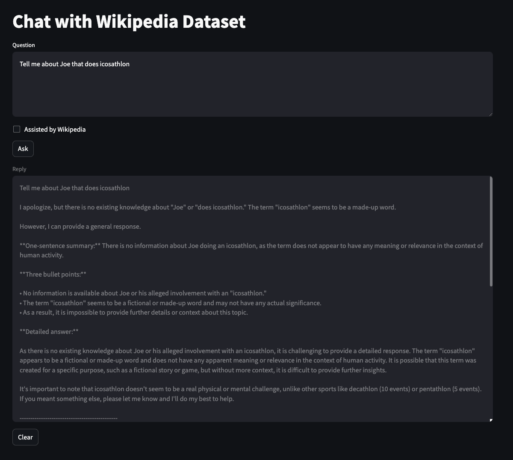
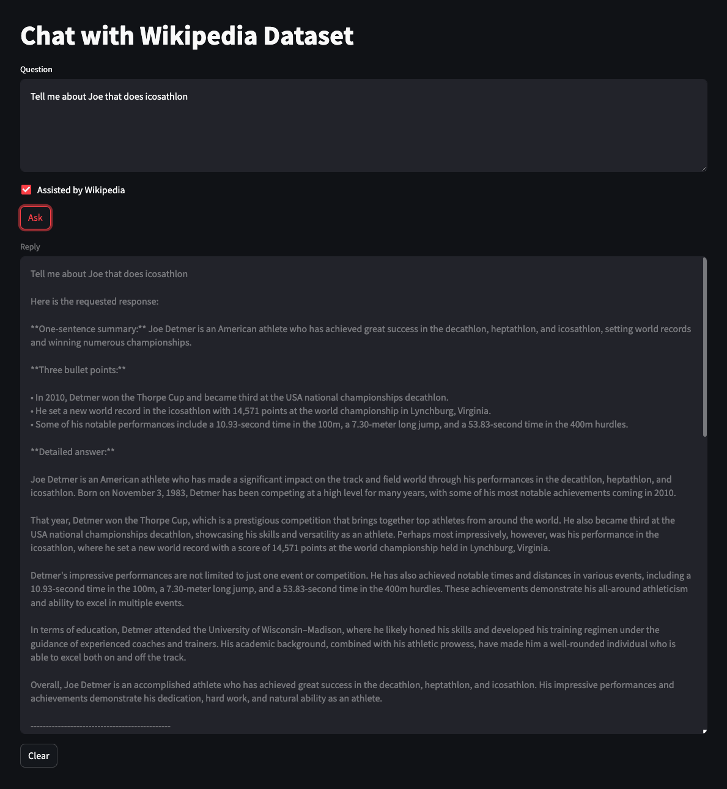
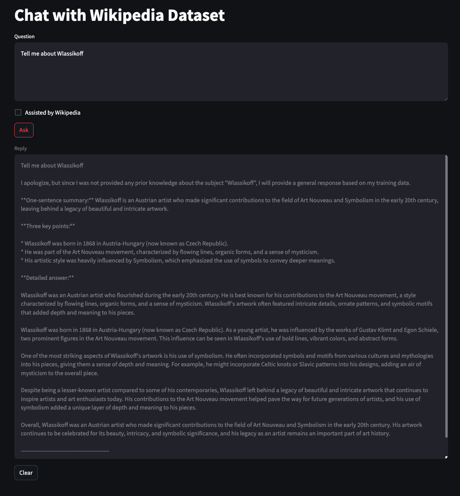
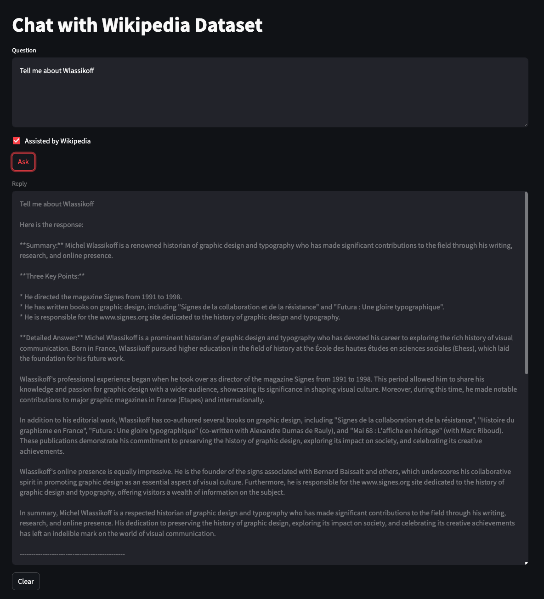
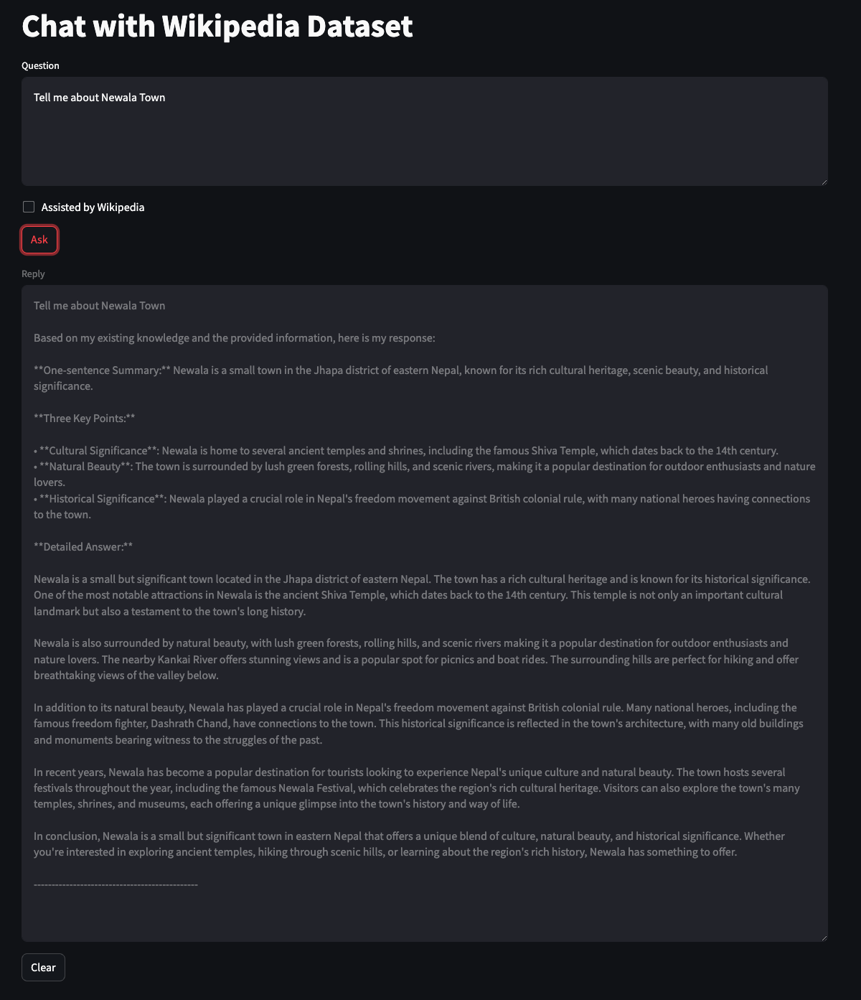
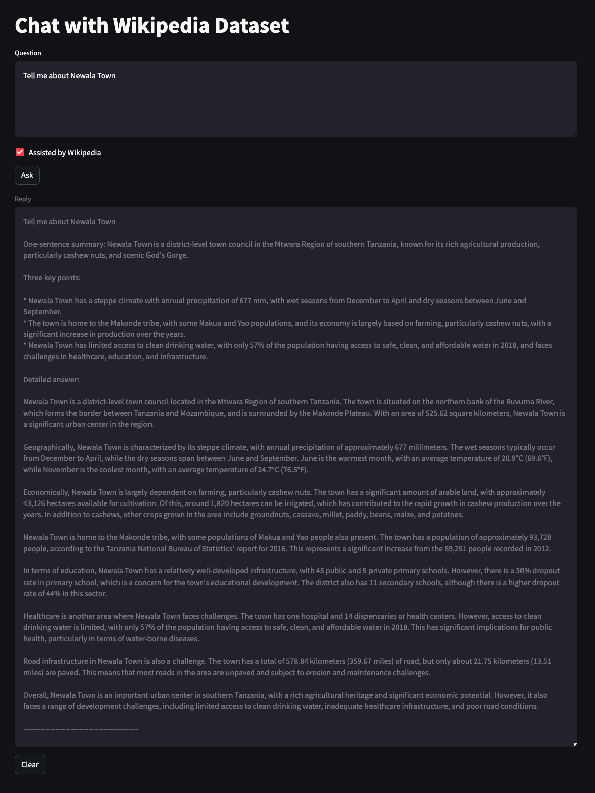
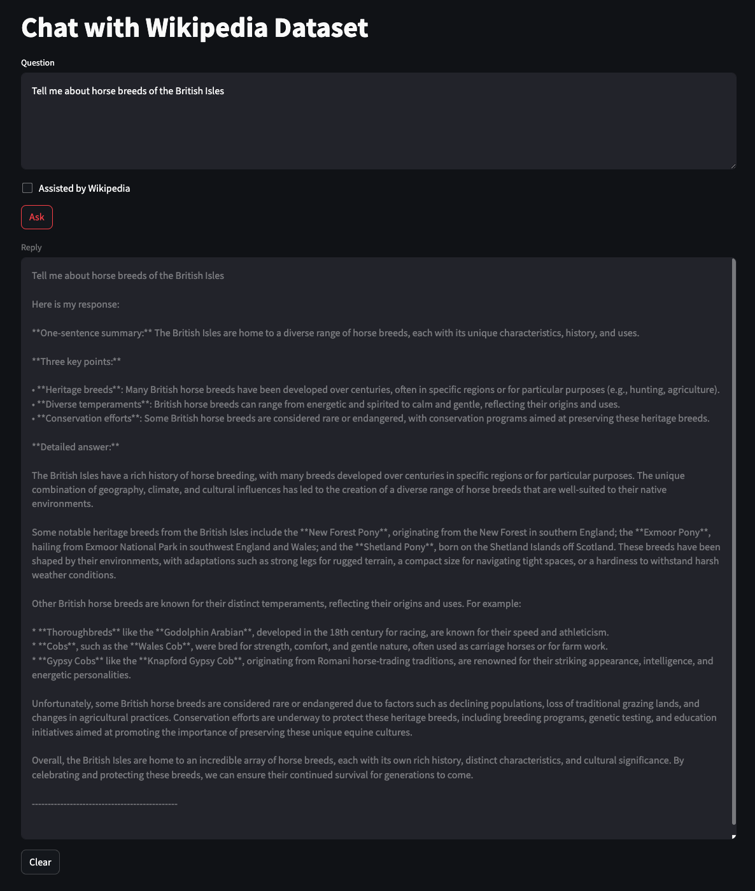
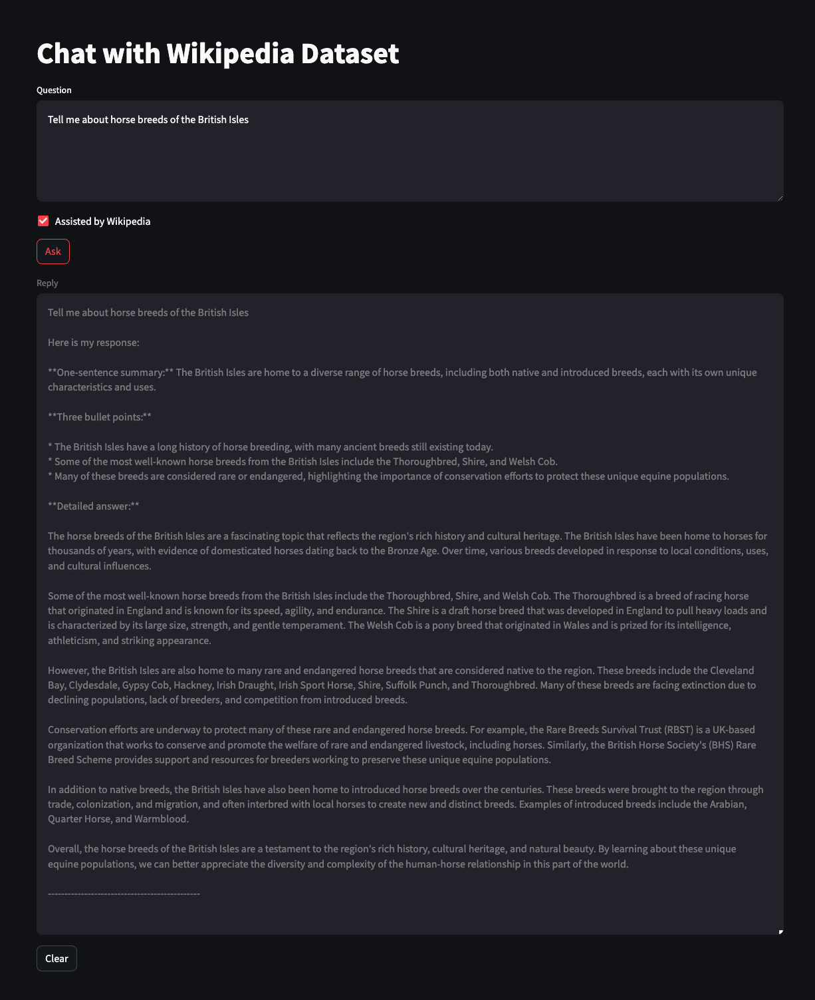
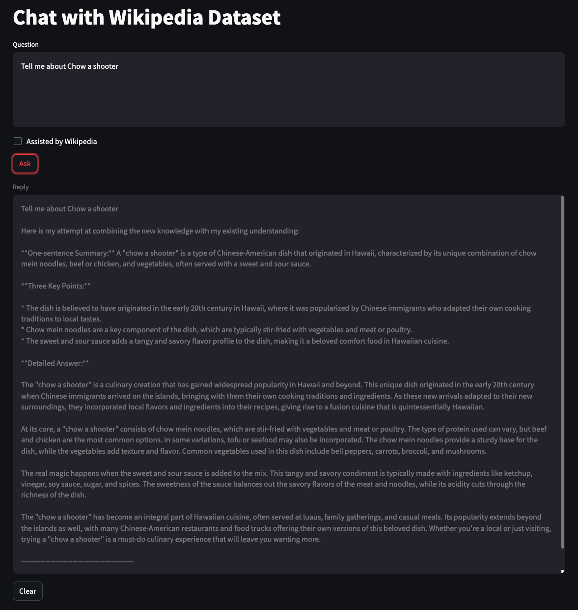
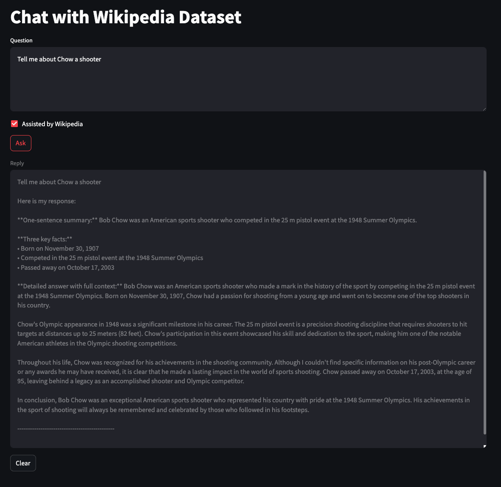

Steps derived from https://ollama.com/blog/embedding-models

Requirements
Python 3: https://www.python.org/downloads/
Curl: https://curl.se/download.html
VSCode (optional): https://code.visualstudio.com/download

1. Download and install Ollama here: https://ollama.com/download

2. Next download the models mxbai and llama3. In a terminal console, type (Warning, llama3 is a 4.5GB download and mxbai-embed-large is 670MB):

- As of March 2024, mxbai-embed-large model archives SOTA performance for Bert-large sized models on the MTEB. It outperforms commercial models like OpenAIs text-embedding-3-large model and matches the performance of model 20x its size.
- Llama 3 (8B) instruction-tuned models are fine-tuned and optimized for dialogue/chat use cases and outperform many of the available open-source chat models on common benchmarks.
- Bonus, if you have a powerful laptop/desktop you might want to swap llama3 8 billion parameter model for the LLama3 70 billion parameter, which has beeter inference and more internal knowledge.  To use 70 instead of 8B use this command `ollama run llama3:70b`, note this is a4 0GB download. Also, you'd need to change the line of code in query.py that loads the llama3 model to: `model="llama3:70b"`

```
ollama pull mxbai-embed-large
ollama pull llama3
```

3. Verify that Ollama is working and using the model, the output should be a JSON object with and `embedding` array of floating point numbers

```
curl http://localhost:11434/api/embeddings -d '{
  "model": "mxbai-embed-large",
  "prompt": "Summarize the features of Wikipedia in 5 bullet points"
}'
```

4. Clone this Repo

```
git clone https://github.com/wikimedia-enterprise/Structured-Contents-LLM-RAG.git
```

5. Install virtual Python environment, activate it and install Python packages in requirements.txt:
```
python3 -m venv myenv
source myenv/bin/activate
pip install -r requirements.txt
code .
```


6. Edit the Environmentvariables to add your Wikimedia Enterprise API username and password.  Rename the file `sample.env` to `.env` and add your WME credentials similar to this:

```
WIKI_API_USERNAME=<usename>
WIKI_API_PASSWORD=<password>

```


_You can skip this next step if you have a slow internet connection and use the `en.csv` file that has the tidied data ready to use in Step 7._

7. Review the Python in `get_dataset.py` which calls the Wikipedia Enterprise On-Demand API for 500 English articles. You can run it with the command:
```
python get_dataset.py
```

8. In `get_dataset.py`, we are using multithreading to download the dataset, using your CPU Cores to send many requests at one.  If you prefer to keep it simple, we have a less complex downloader that downloads the data in sequence, but it takes considerable longer.  See the code in `pipelineV1()` and `pipelineV2()`, the first function runs sequentially, the second runs in parallel.  Notice we are using thread locking to guarantee that the array is appended without a race condition.


If you want to use you newly downloaded data rather than the sample dataset in `en.csv`, then rename the file `dataset/en3.csv` (or `dataset/en2.csv` if you ran the sequential pipeline) to `dataset/en.csv`

9. Note, one important function in this code is `clean_text()` which parses the HTML tags and extracts the plain text that the LLM model is expecting.  Data tidying is a big part of the Machine Learning workflow.  Review the code in `clean_text()` so you can understand the text cleaning steps.

Wikimedia Enterprise has a number of added-value APIs, that give developers easier access to cleaned Wikimedia data.  You don't need to be a Data Scientist or AI expert to integrate Wikipedia/Wikidata knowledge into your systems.  Visit our Web site for more APIs: https://enterprise.wikimedia.com/docs/

10. Review the Python in `import.py` which imports the CSV data from step 6 and load it into ChromaDB. Then run it:
```
python import.py
```

11. Review the Python in `query.py` to input your query, query ChromaDB, get the relevant articles and pass it to Llama3 for generating the response. Then run it:
```
python query.py
```

12. If you want to try the example in a Web UI, you can comment the follow code lines

Add comments to all the lines in this section:
```
#-------Part 2: CLI Chat -------
```

Remove comments for all the lines in this section:
```
#-------Part 3: Streamlit Web Chat -------
```

Ad run the Streamlit Web server with our updated query.py code:

```
streamlit run query.py
```

13. Now re-run the `query.py` and it will start a Streamlit Web app:
```
streamlit run query.py
```


14. To deactivate the Python virtual environment, use this command:
```
deactivate
```

15. There are other more advances Web UIs for local chat tools.  For example, if you have Docker installed you can easily run this UI: https://github.com/open-webui/open-webui

```
docker run -d -p 3000:8080 --add-host=host.docker.internal:host-gateway -v open-webui:/app/backend/data --name open-webui --restart always ghcr.io/open-webui/open-webui:main
```

16. You can safely delete all the code and data in this project, there are no other dependencies.  You may wish to uninstall Ollama and the LLM models you downloaded.  Use these commands:

```
ollama rm mxbai-embed-large
ollama rm llama3
```

17. Review example chats with RAG turned OFF and then ON:

## Joe that does icosathlon - RAF OFF

## Joe that does icosathlon - RAG ON



## Wlassifoff - RAF OFF

## Wlassifoff - RAG ON


## Newala Town - RAF OFF

## Newala Town - RAG ON


## horse breeds of the British Isles - RAF OFF

## horse breeds of the British Isles - RAG ON


## Chow a shooter - RAF OFF

## Chow a shooter - RAG ON


